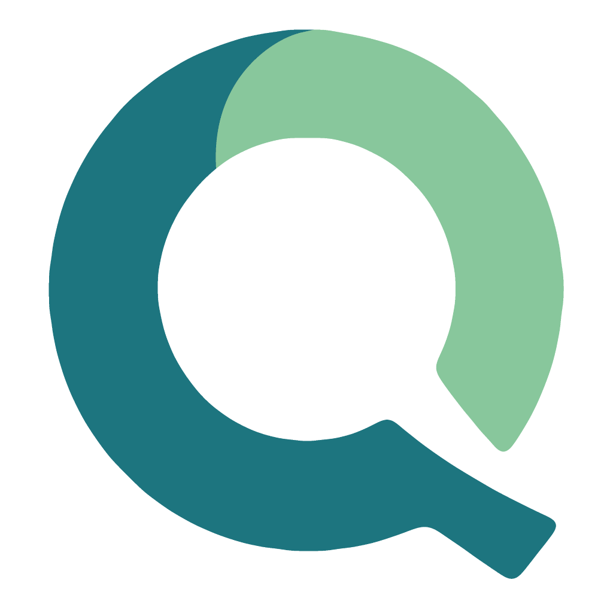
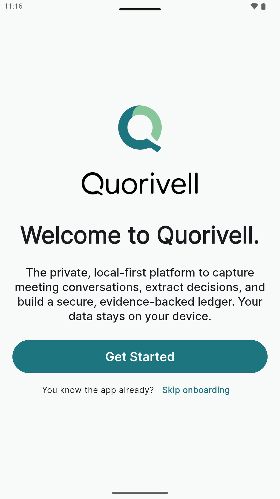
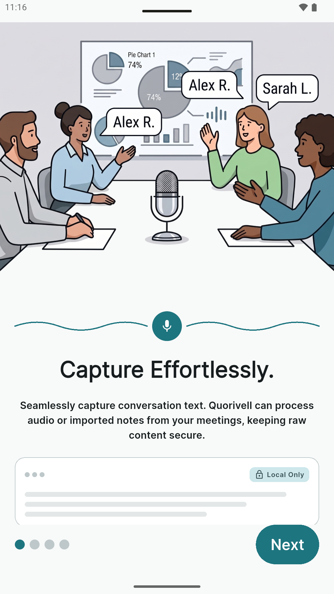
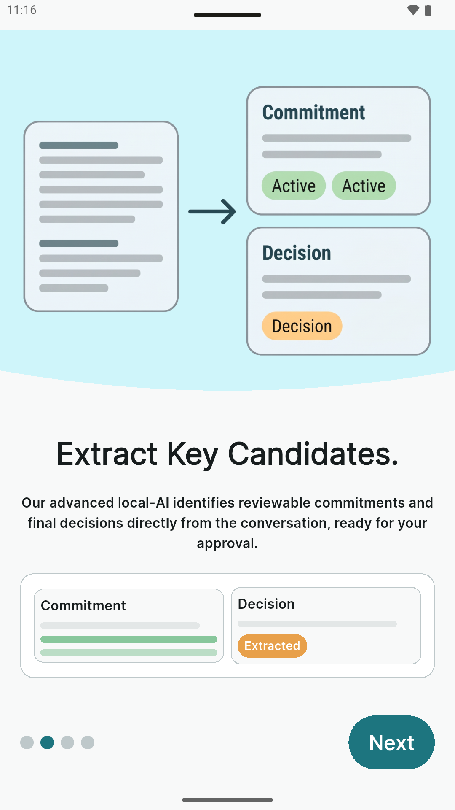
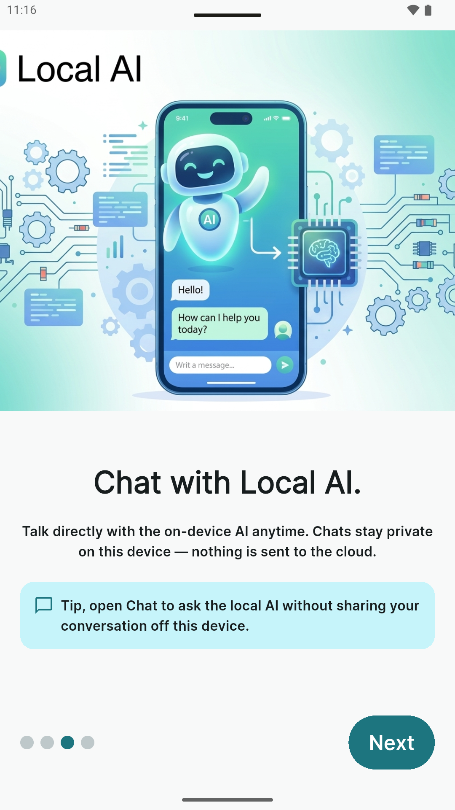
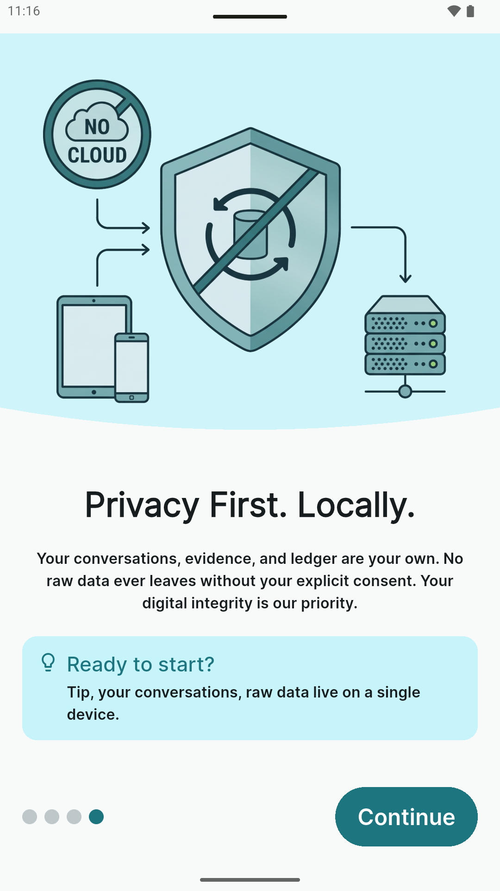
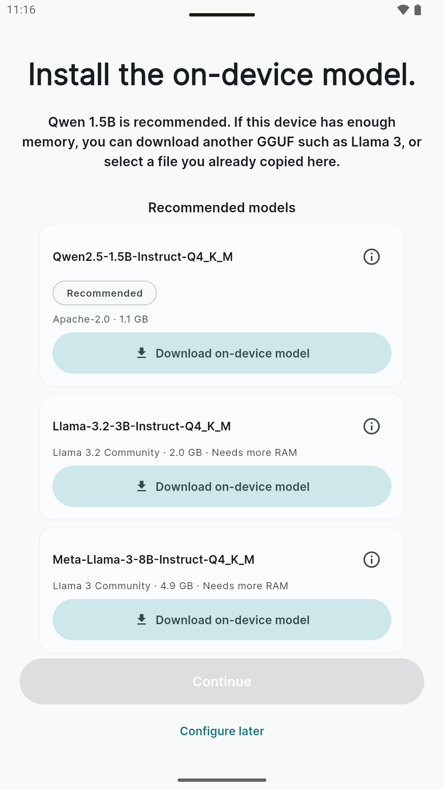

# Quorivell

<p align="center">
  
</p>

<p align="center">
  <a href="LICENSE"></a>
  <a href="https://github.com/cherifsahraoui/Quorivell"></a>
  <a href="https://play.google.com/store/apps/details?id=com.quorivell.app"></a>
</p>

<p align="center"><strong>Decisions, with evidence — on your device.</strong></p>

**Quorivell** is a local-first Flutter app that turns messy conversations into
reviewable decisions and commitments. Capture source text, run on-device
extraction, review candidates with evidence, and keep an auditable ledger —
without sending your conversations to the cloud.

Privacy is the product: **Drift on device is canonical**, inference runs
**locally via llama.cpp**, and source content stays on the phone unless you
later opt into an explicit remote flow.

<p align="center">
  
  
  
  
  
  
</p>

---

## 📲 Try it on Google Play

1. **Join closed testing** (Play invites you via the testing Google Group):  
   [play.google.com/apps/testing/com.quorivell.app](https://play.google.com/apps/testing/com.quorivell.app)
2. **Install** from the store listing:  
   [play.google.com/store/apps/details?id=com.quorivell.app](https://play.google.com/store/apps/details?id=com.quorivell.app)

Closed testing may take a short while to show the install button after you join.

---

## ☕ Support the project

[](https://www.buymeacoffee.com/cherifsahraoui)

If Quorivell helps you keep decisions straight, you can
[buy me a coffee](https://www.buymeacoffee.com/cherifsahraoui).

---

## ✨ Capabilities

| | |
| --- | --- |
| **Capture** | Save conversation text as source records |
| **Extract** | On-device candidates from a configurable kind catalog |
| **Review** | Accept only with evidence — nothing auto-writes the ledger |
| **Ledger** | Decisions, commitments, owners, and due dates you can audit |
| **Chat** | Free-form threads on the same local GGUF |
| **Local & private** | Offline Drift store; no wired cloud AI for capture/extract |
| **Locales** | EN / DE / AR UI (Material 3) |

---

## 🛠️ Build from source

### Prerequisites

- Flutter **≥ 3.35.7** (SDK constraint in `pubspec.yaml`)
- Android emulator or device

Android **llama.cpp** `.so` libraries for `arm64-v8a` and `x86_64` are
included under `android/app/src/main/jniLibs/`. Rebuild only if you change
the llama.cpp pin (see Documentation below).

### Install and run

```bash
git clone https://github.com/cherifsahraoui/Quorivell.git
cd Quorivell
flutter pub get
dart run build_runner build --delete-conflicting-outputs
flutter run
```

Firebase client config (`lib/firebase_options.dart`,
`android/app/google-services.json`) is **not** shipped. Local-only capture and
on-device AI work without it. If you need Firebase Auth / App Check bootstrap,
run `flutterfire configure` against your own project.

On first launch, finish onboarding:

1. **Download on-device model** (~1.1 GB recommended GGUF), or
2. **Select model file** (import a local instruct GGUF)

Capture and extract stay blocked until a verified (or user-imported) model is
ready.

### Useful regenerations

| After you change | Run |
| --- | --- |
| `lib/l10n/*.arb` | `flutter gen-l10n` |
| Riverpod / Freezed / Drift / JSON annotations | `dart run build_runner build --delete-conflicting-outputs` |

Never hand-edit generated `*.g.dart`, `*.freezed.dart`, or
`lib/l10n/app_localizations*.dart`.

---

## 📚 Documentation

Each topic lives in one place — start here, then drill down:

<p>
  <a href="docs/architecture.md"></a>
  <a href="docs/data-structures.md"></a>
  <a href="docs/native/building-llama-cpp.md"></a>
  <a href="docs/licenses/README.md"></a>
</p>

| Doc | Owns |
| --- | --- |
| **Architecture** | Brand, stack, privacy, Firebase reality, on-device model ops (Appendix A) |
| **Data structures** | Drift schema, entities, Firestore mirror contract |
| **Building llama.cpp** | Rebuild Android `.so` / Windows DLLs |
| **Model licenses** | Notices for every in-app catalog GGUF |

---

## 🚧 Status

Quorivell is under active development. Expect sharp edges, especially around
large-model downloads on constrained devices.

<p>
  <a href="https://cursor.com"></a>
</p>

Large parts of this codebase were written with AI assistance in
[Cursor](https://cursor.com). Treat unfamiliar code paths, prompts, and
generated wiring with healthy skepticism — review before you rely on them in
production, and prefer tests over assumptions.

Contributions welcome — please open an issue before large architectural PRs.

---

## 📄 License

Released under the [MIT License](LICENSE). Copyright (c) 2026 Cherif Sahraoui.

**Model weights** are not in this repository. Catalog downloads use their
upstream licenses — see
[docs/licenses/README.md](docs/licenses/README.md).
